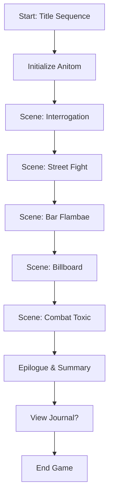
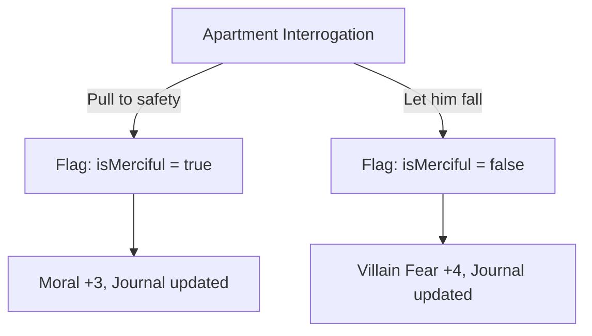

# ROBERT'S PIVOT – ANITOM Narrative Engine

**Version:** 2.3
**Language:** C++
**Type:** Visual Novel / Interactive Narrative Simulation

ROBERT’S PIVOT is a dynamic, text-based visual novel engine implemented in C++ using **real-time animations, choice-driven narrative, and consequence tracking**. It leverages a modular architecture with **animation utilities**, **story state management**, and **UI interaction systems**.

---

## Table of Contents

1. [Project Overview](#project-overview)
2. [System Architecture](#system-architecture)
3. [AnimationSystem](#animationsystem)
4. [Anitom Class](#anitom-class)
5. [GameUI Class](#gameui-class)
6. [Decision Paths](#decision-paths)
7. [Scene Flow](#scene-flow)
8. [Flowcharts](#flowcharts)
9. [Main Execution](#main-execution)
10. [Credits](#credits)

---

## Project Overview

ROBERT’S PIVOT is designed as a **dynamic narrative engine** where the player controls the protagonist Robert. Player actions affect:

* **Hero alignment and moral balance**
* **Relationships with NPCs**
* **Combat efficiency**
* **Narrative outcomes and multiple endings**

It emphasizes:

* Real-time visual effects (typewriter, shimmer, fade-in)
* Interactive decision-making
* Consequence tracking (via flags and counters)
* Story progression through scenes

---

## System Architecture

The program is structured into three main modules:

1. **AnimationSystem** – Handles visual effects and text animations.
2. **Anitom** – Core engine managing protagonist stats, flags, counters, relationships, and journal.
3. **GameUI** – Handles scene presentation, status display, and player choices.

Additionally, the program contains **scene functions** defining narrative events and the **main loop** for execution.

```
+-------------------+
|   main()          |
|-------------------|
| - titleSequence() |
| - scene functions |
| - epilogue        |
+-------------------+
         |
         v
+-------------------+
|   Anitom          |
|-------------------|
| Flags, counters   |
| Relationships     |
| Journal           |
+-------------------+
         |
         v
+-------------------+
|   GameUI          |
|-------------------|
| Scene display     |
| Choice handling   |
| Status/Progress   |
+-------------------+
         |
         v
+-------------------+
| AnimationSystem   |
|-------------------|
| Typewriter        |
| Loading dots      |
| Shimmer/Fade      |
| Progress bars     |
+-------------------+
```

---

## AnimationSystem

Provides a set of **visual and text effects** for a dynamic storytelling experience.

### Key Functions

1. **loadingDots(int count, int speed)**

   * Displays animated dots `.` for loading effects.

   ```cpp
   AnimationSystem::loadingDots(3, 200);
   ```

2. **shimmerText(const string &text, int iterations)**

   * Animates text with a shimmer effect.

   ```cpp
   AnimationSystem::shimmerText("ROMANTIC PATH ACTIVATED", 2);
   ```

3. **fadeIn(const string &text, int stepDelay)**

   * Displays text one character at a time.

   ```cpp
   AnimationSystem::fadeIn("ROBERT'S PIVOT", 20);
   ```

4. **typewriter(const string &text, int speed, bool newline)**

   * Classic typewriter effect for narrative text.

   ```cpp
   AnimationSystem::typewriter("You pull the thug to safety.", 30);
   ```

5. **pulseBorder(int width, int height, int pulses)**

   * Pulsing borders for scene transitions or alerts.

6. **progressBar(const string &label, int duration, int width)**

   * Visualizes task or narrative progress.

7. **explodeText(const string &text)**

   * Dramatic visual effect for pivotal moments.

   ```cpp
   AnimationSystem::explodeText("RUTHLESS REPUTATION ESTABLISHED");
   ```

8. **slideIn(const string &text, char direction, int speed)**

   * Animates text sliding from a direction.

9. **clearScreen()**

   * Clears console for scene transitions.

---

## Anitom Class

Central narrative engine storing **player metrics, flags, relationships, and journal entries**.

### Core Components

* **Flags:** Boolean states affecting choices (e.g., `isMerciful`, `romanticPathActive`)
* **Counters:** Numeric metrics (e.g., `moralBalance`, `heroReputation`)
* **Relationships:** Tracks NPC relationships (e.g., `blondeBlazer`)
* **Journal Entries:** Stores narrative logs with timestamps

### Example: Flag Handling

```cpp
storyEngine.setFlag("isMerciful", true);
bool mercy = storyEngine.getFlag("isMerciful");
```

### Example: Counter Adjustment

```cpp
storyEngine.adjustCounter("moralBalance", 3);
int moral = storyEngine.getCounter("moralBalance");
```

### Hero Style & Alignment Calculations

* **Alignment:** Based on `moralBalance`

  * `>=3` → Paragon
  * `<=-3` → Renegade
  * Otherwise → Pragmatist
* **Style:** Based on `tacticalMastery` and `isMerciful`

  * Strategic Guardian, Calculated Enforcer, Compassionate Defender, Brutal Enforcer

---

## GameUI Class

Responsible for **displaying scenes, status, and player choices**.

### Key Functions

1. **displaySceneHeader(title)** – Shows scene title with animation
2. **displayStats(Anitom &anitom)** – Shows hero status, moral bar, and reputation
3. **displayChoices(choices, prompt)** – Displays numbered options and receives validated input
4. **sceneTransition(from, to)** – Transition effect between scenes

### Example: Displaying Choices

```cpp
vector<string> options = {"Save NPC", "Ignore NPC"};
int choice = GameUI::displayChoices(options, "Choose action:");
```

---

## Decision Paths

Player choices **directly influence flags, counters, and relationships**, resulting in **branching story outcomes**.

**Example: Apartment Interrogation Scene**

* **Choice 1:** Pull thug to safety

  * `isMerciful = true`
  * `moralBalance +3`
  * Journal updated

* **Choice 2:** Let him fall

  * `isMerciful = false`
  * `villainFear +4`
  * Journal updated

**Decision Tree Example:**

```
Apartment Interrogation
├─ Pull to safety
│  ├─ Moral +3
│  └─ Journal: Saved Goon
└─ Let him fall
   ├─ Villain Fear +4
   └─ Journal: Eliminated Goon
```

---

## Scene Flow

Scenes follow a **modular sequence**:

1. `scene_interrogation()` → Initial moral choice
2. `scene_street_fight()` → Combat mechanics, injury risk
3. `scene_bar_flambae()` → Social interaction & affinity building
4. `scene_billboard()` → Romantic path opportunity
5. `scene_combat_toxic()` → Final battle / finishing moves
6. `epilogue_summary()` → Summary of outcomes and career report

---

## Flowcharts

### Main Game Loop



### Choice Impact



---

## Main Execution

```cpp
int main() {
    srand(time(0));
    titleSequence();
    storyEngine = Anitom("Robert");

    scene_interrogation();
    scene_street_fight();
    scene_bar_flambae();
    scene_billboard();
    scene_combat_toxic();
    epilogue_summary();

    AnimationSystem::clearScreen();
    // Display credits
}
```

---

## Credits

* **ANITOM System v2.3** – Narrative engine
* **Dynamic Choice Architecture**
* **Relationship State Machine**
* **Real-time Consequence Tracking**

Created for the **Dispatch Universe**.
